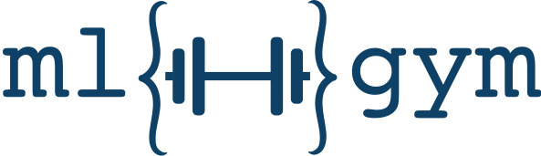








# 📝 Publications 

<!-- Paper-4 -->

  

    

      
IEEE - ICSA 2025

      
    

  

  

  2025 - [Architectural Proposal for Reproducible, Standardized Deep Learning Research](https://github.com/mlgym/mlgym/tree/project-for-UI-documentation).
  
  Max Lübbering, **Vijul Shah**, Moinam Chatterjee, Priya Priya, Osama Soliman, Rafet Sifa

  <strong>
    
  </strong>

  

<!-- Paper-3 -->

  

    

      
ETRA 2025

      
    

  

  

  2025 - [PupilSense: A Novel Application for Webcam-Based Pupil Diameter Estimation](https://huggingface.co/spaces/vijulshah/pupilsense).
  
  **Vijul Shah**, Ko Watanabe, Brian B. Moser, Andreas Dengel

  <strong>
    
  </strong>

  

<!-- Paper-2 -->

  

    

      
ICAART 2025

      
    

  

  

  2025 - [Webcam-based Pupil Diameter Prediction Benefits from Upscaling](https://www.scitepress.org/publishedPapers/2025/131628/pdf/index.html).
  
  **Vijul Shah**, Brian B. Moser, Ko Watanabe, Andreas Dengel

  <strong>
    
  </strong>

  

<!-- Paper-1 -->

  

    

      
Arxiv 2024

      
    

  

  

  2024 - [EyeDentify: A Dataset for Pupil Diameter Estimation based on Webcam Images](https://arxiv.org/abs/2407.11204).

  **Vijul Shah**, Ko Watanabe, Brian B. Moser, Andreas Dengel

  <strong>
    
  </strong>

  

# 📖 Educations

- *2021 - 2024*, Computer Science, M.Sc., RPTU Kaiserslautern, Germany
  - 1st Specialization in Intelligent Systems.
  - 2nd Specialization in Data Visualization & Scientific Computing.
  - Thesis: Pupil Diameter Estimation Using Super Resolution

- *2016 - 2020*, Computer Science, B.E., LDRP-ITR Gandhinagar, India  

# 🎖 Certificates

- *July 06, 2018* - Oracle Certified Expert, Java EE 6 Web Component Developer. [See the info here](https://www.credly.com/users/vijul-shah)

- *October 06, 2017* - Oracle Certified Professional, Java SE 6 Programmer. [See the info here](https://www.credly.com/users/vijul-shah)

# 💻 Experiences

- *April 2025 - Current*:  Data Scientist at Fraunhofer IAIS, Sankt Augustin, Germany.

- *Dec 2022 - March 2025*:  Machine Learning Engineer at Fraunhofer IAIS, Sankt Augustin, Germany.

- *April 2022 – Aug 2022*: Research Assistant at DFKI (German Research Center for Artificial Intelligence), Kaiserslautern, Germany.

- *Aug 2020 – Sept 2021*: Full Stack Developer at Bonds India, New Delhi, India.

- *Dec 2019 – Jun 2020*: App Development Intern at Stackmaze solutions pvt ltd, Ahmedabad, India

<!-- # Projects
- *2019.05 - 2020.02*, [Lorem](https://github.com/), China. -->

# 🌐 Languages

- English: Professional Proficiency (C1 - IELTS)
- German: Elementary Proficiency (A2 - German Exam)
- Hindi: Professional Proficiency
- Gujarati: Mother Tongue
